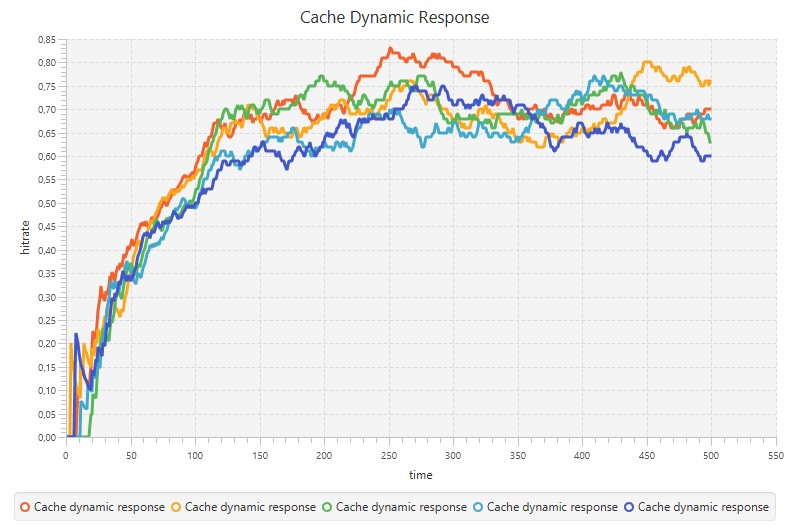
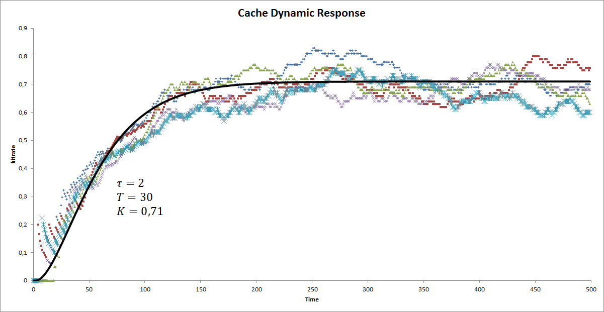
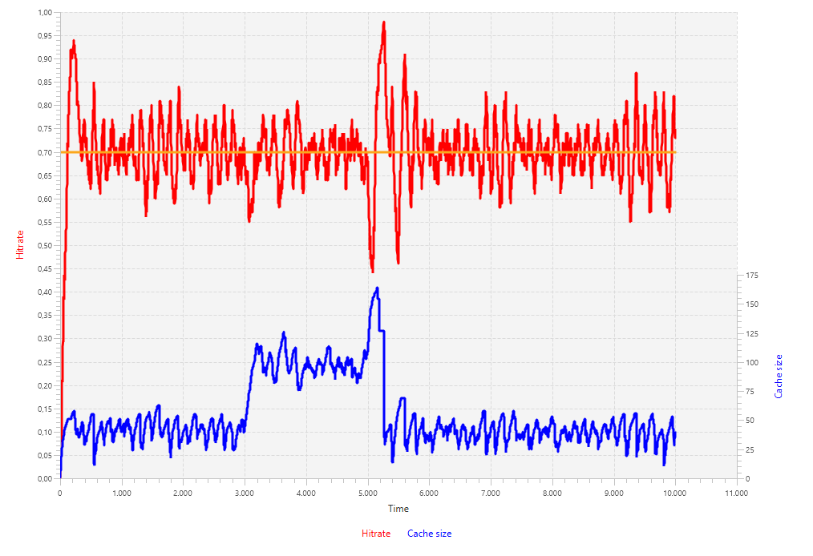

#Cache hit rate control
In computer science caches are used in various places in order to speed up the response to common queries or requests. Instead of doing the same long and slow calculation or disk operation again and again, we can save the result in memory the first time we receive the request. The next time a request comes in, we first look whether or not its result is already in the cache. We only choose to perform the calculation or disk operation if the result is not in the cache. From this we define a successful request as one whose result was in the cache already

A good metric for how well the cache performs is the hit rate, which is the success rate of requests. This metric can be influenced by altering the cache size as well as by which requests are done. Keeping the cache size constant can obtain a 100% hit rate if always the same request is done, but also might obtain a much lower hit rate if many different requests are done.

Unfortunately in practice we cannot control which requests are done, hence we can only adjust the size in order to increase the hit rate. Although in theory we could make the cache infinitely big, in practice we have a limited amount of space. To be more specific, we want to maintain a certain hit rate with as few space as possible.

##System design
We are going to construct a feedback control system that controls the cache size and hence tries to maintain a certain hit rate. A first hurdle is to choose an output quantity. Although a cache's output actually is the result of the request, we are only interested in whether or not this result was already in the cache. Therefore the cache's output can be modelled as a Boolean variable. The hit rate is then defined as the *trailing average number of successes over the last k requests*.

This directly gives us a second hurdle, this time a more mathematical one: *how large does k need to be*? In order to answer this question, we need to observe that (since each request results either in success or failure, a.k.a. a Boolean) requests can be regarded as [Bernoulli trials](http://en.wikipedia.org/wiki/Bernoulli_distribution). From the [classical central limit theorem](http://en.wikipedia.org/wiki/Central_limit_theorem#Classical_CLT) it follows that the standard deviation of such Bernoulli trials with size *k* is approximately 0.5/√*k*. If we want to have good control, we need to know the success rate to within at least 5% or better, hence *k* needs to be approximately 100.

Having solved these two issues we can now construct our feedback control system around the actual cache. To convert the Boolean results of the case into hit rates we will use a [FixedFilter](Simulation-Framework.md#filters-and-actuators).


The cache can now be implemented as follows:

```scala
class Cache(size: Int, demand: Long => Int, internalTime: Long = 0, cache: Map[Int, Long] = Map(), res: Boolean = false) extends Component[Double, Boolean] {

	def update(u: Double): Cache = {
		val time = internalTime + 1
		val newSize = math.max(0, math floor u)
		val item = demand(time)

		if (cache contains item) {
			val newCache = cache + (item -> time)

			new Cache(newSize toInt, demand, time, newCache, true)
		}
		else if (cache.size >= size) {
			val n = 1 + cache.size - size
			val vk = cache map { case (i, l) => (l, i) }
			val newCache = (cache /: vk.map { case (l, _) => l }.toList.sorted.take(n).map(vk(_)))(_ - _)

			new Cache(newSize.toInt, demand, time, newCache + (item -> time), false)
		}
		else {
			val newCache = cache + (item -> time)

			new Cache(newSize.toInt, demand, time, newCache, false)
		}
	}

	def action: Boolean = res

	def monitor = Map("Cache hit rate" -> action, "Cache size" -> cache.size)
}
```

##Controller settings
After having constructed the feedback system, we need to decide what kind of controller we will use. The most obvious candidate is the PID controller, which needs two or three parameters (depending on using it as a PI controller or PID controller). As discussed [previously](Controllers.md), a PID controller is the sum of the proportional, integral and derivative control:


The parameters of this controller (,  and ) will make *the* difference between a good or bad functioning system; therefore choosing the correct values is an important task.

In order to retrieve these values, we need to take a closer look at the controlled system (the cache) first and discover what it's behavior is. First we will look at the static process characteristics, which determines what the size and direction of the ultimate change in the process output is when an input of a certain size is applied. When the static behavior is known, we can use its results to determine the dynamic response: how long does it take for the system to respond to a sudden input change? Notice that both these experiments are done in an [open-loop setting](Feedback-Systems.md) and without a controller. In the case of our cache we consider the controlled system to be the cache combined with the FixedFilter.

###Static process characteristics
To measure the static process characteristics we just have to turn on the controlled system, apply a steady input value, wait until the system has settled down and record the output. We do this in the following code sample. The demand is drawn from a gaussian distribution with mean 0 and variance `demandWidth`. Then we construct the controlled system and follow the procedure described above: 

```scala
def simulation(): Observable[(Double, Double)] = {
	val demandWidth = 15
	def demand(t: Long) = math floor gaussian(0, demandWidth) toInt

	val p = new Cache(0, demand) map(if (_) 1.0 else 0.0)
	val f = new FixedFilter(100)
	staticTest(p ++ f, 150, 100, 5, 3000)
}

def gaussian(mean: Double, stdDev: Double) = new Random().nextGaussian() * stdDev + mean

def staticTest[A](initPlant: Component[Double, A], umax: Int, stepMax: Int, repeatMax: Int, tMax: Int): Observable[(Double, A)] = {
	val steps = (0 until stepMax).toObservable.observeOn(ComputationScheduler())
	val repeats = (0 until repeatMax).toObservable
	val ts = (0 until tMax).toObservable
	staticTest(initPlant, umax, steps, repeats, ts)
}

def staticTest[A](initPlant: Component[Double, A], umax: Int, steps: Observable[Int], repeats: Observable[Int], ts: Observable[Int]): Observable[(Double, A)] = {
	for {
		i <- steps
		u <- steps.size.single map { i.toDouble * umax / _ }
		plant <- repeats map { r => initPlant }
		y <- (ts map (_ => u) scan(plant))(_ update _) drop 1 map (_ action) last
	} yield (u, y)
}
```

Since we are working with some form of a stochastic process, we need to take into account that the pattern of requests might vary from time to time. Therefore we will simulate multiple scenarios of the static process characteristics with different values for `demandWidth`:


From these simulations we can derive that if we want a hit rate of 0.7, we need a cache size of about 40-70, assuming that a demandWidth of 15-35 is the most common situation.

###Dynamic response
The next step in determining the parameters of the PID controller is to conduct a step test to measure the dynamic response of the system. Performing this experiment is just a matter of turning on the system and observing what happens. First let the system be at rest initially (zero input). Then apply a sudden (preferably large) input change and record the development of the output value over time. If possible, do this a number of times in order to get a good signal-to-noise ratio.

```scala
def stepResponse[A, B](time: Observable[Long], input: Long => A, plant: Component[A, B]): Observable[B] = {
	(time map input scan plant)(_ update _) drop 1 map (_ action)
}

def simulation: Observable[Double] = {
	def demand(t: Long) = math floor Randomizers.gaussian(0, 15) toInt
	def input(time: Long): Double = 40

	val p = new Cache(0, demand) map(if (_) 1.0 else 0.0)
	val f = new FixedFilter(100)
	stepResponse(time, input, p ++ f)
}
```

Doing so with the implementation of a cache will yield the following data, gathered over the course of 5 iterations and applied with an input change of 40.



####Finding the first values
The analysis of this data can be done in multiple ways. A first option is to draw a tangent through the inflection point of the data and then use the construction below to find the values for K, τ and T which we will use in a later stage.


Although there are complete books written about finding these three values and what their relation is to the parameters of a PID controller, for us it is only necessary to understand what these values mean:

* **Process gain K** is the ratio between the value of the applied input signal and the steady-state process output after all transients have disappeared. In the construction above it is denoted as the height of the asymptote of the output.
* **Time constant T** denotes the time it takes for the process to settle to a steady state. Usually in this context 'settle' is defined as about 63% of its final value.
* **Dead time τ** is the initial delay until the first input changes will begin to have any effect on the output.

Unfortunately the data is more than often not as smooth as the red curve in the construction above. Since the data drawn from the experiment with the cache contains a lot of noise, it is a difficult task to find the inflection point and draw a tangent through it. What is a tangent to noisy data, after all? But besides that, it might be possible that (even when the data is smoothened enough) there is no inflection point at all. In that case, try to imagine where the inflection point would be if it would be there, and draw the tangent there. Of course, the values won't be as precise, but as we will see later, it is all a matter of eyeballing.

A second method of finding the values for K, τ and T is to fit a model through the data. Most commonly the following model is used to describe the step response of a process like the cache:


A little more complex model solves an issue with this simple model: it has no vanishing slope as t gets closer to τ.


By fitting either of these models onto the data, we will find the values for K, τ and T. Notice that both models give different results, as shown in the fittings of the respective models below:




In the following we will use the results found by fitting the simple model.

####Calculating the PID parameters
Once we have found values for K, τ and T, we can use multiple sets of tuning formulas (indicated as **Ziegler-Nichols**, **Cohen-Coon** and **AMIGO**) to find the parameters of the PID controller that we need to use. It should be noted that these sets will all give different results, which may vary considerably. Altogether these methods will give us however a good indication of the *range* where the parameters possibly lie. Respectively the Ziegler-Nichols, Cohen-Coon and AMIGO tuning formulas are given below. For each type of controller (P, PI and PID) the parameters ,  and  are specified:


When using these formulas, keep in mind that K is the ratio of the applied input signal and the final steady-state process output. Therefore, divide K by the input signal first, before plugging it in the tuning formulas. Since the input signal was 40, the value to be plugged in for K is 0.71/40 = 0.01775, where the latter K is the one found in the analysis phase.

Choosing to control the system with a PI controller and using the tuning formulas we find the following results:

|     | Ziegler-Nichols | Cohen-Coon | AMIGO |
|:---|---:|---:|---:|
||192.7|239.3|48|
||4.3|7.5|1|
||0|0|0|

The next and final step is to try out values within these ranges by simulating the entire feedback system (controllers, actuators, controlled system, and filters included) as designed at the start of this page. The demand will be simulated by drawing values from a gaussian distribution. Changes in demand will be taken into account by changing the mean and variance of the distribution at times `t = 3000` and `t = 5000`. The former change increases the variance from 15 to 35, keeping the mean at 0, such that more values will be asked for. The latter demand change brings the mean up to 100, causing the demand function to return entirely new values. Because of this, the cache will need to repopulate, which is expected to take some time.

```scala
def simulationForGitHub(): Observable[Double] = {
	def time: Observable[Long] = (0L until 10000L).toObservable observeOn ComputationScheduler()
	def setpoint(t: Long): Double = 0.7

	def gaus(tuple: (Int, Int)) = math floor Randomizers.gaussian(tuple _1, tuple _2) toInt
	def demand(t: Long) = gaus(if (t < 3000) (0, 15) else if (t < 5000) (0, 35) else (100, 15))

//	val c = new PIDController(192.7, 4.3) // Ziegler-Nichols
//	val c = new PIDController(239.3, 7.5) // Cohen-Coon
//	val c = new PIDController(48, 1)      // AMIGO
	val c = new PIDController(200, 2)
	val p = new Cache(0, demand) map(if (_) 1.0 else 0.0)
	val f = new FixedFilter(100)
	val plant = p ++ f

	Loops.closedLoop(time map setpoint, 0.0, c ++ plant)
}
```

The first simulation uses the values obtained from the Ziegler-Nichols tuning formulas. The results are quite poor, given the oscillations in the hitrate of about 15 percentage point both positively and negatively. Notice that the change in demand is reflected in the cache size. When the variance of the demand gets bigger, the cache size needs to be bigger as well and when the mean changes, the cache needs to repopulate itself and hence grows bigger first and shrinks back to smaller sizes.



Although Ziegler-Nichols' results seemed poor, the results of Cohen-Coon are actually worse. The system is oscillating so much that changes in demand are not even noticeable. From this it becomes clear that parameters for the PID controller are not what we want in this case.


Using lower values for the controller the system seems to work something better, as shown by the results of the AMIGO simulation. The hit rate seems to track the setpoint better than before, the number of oscillations is less and their amplitude is smaller. However, it now takes longer for the system to respond to demand differences.


To solve this issue, we will keep the integral part at a low value (`ki = 2`) and set the proportional part of the controller at a value in the order of Ziegler-Nichols and Cohen-Coon (`kp = 200`). This gives better results: fewer oscillations and a quicker response to demand changes.


## Summary
The cache is a typical example of how to use feedback control in practice. Analysing the case, we found that the cache requests could be viewed as Bernoulli trials and that we needed an average of the last 100 trials to get a hit ratio with about 95% accuracy.

Further analysis in the behavior of the cache system revealed the static process characteristics as well as the internal dynamics, which both need to be taken into account when choosing the values for the control system's PID controller. To measure the **static process characteristics**, we just have to turn on the controlled system in an open-loop setting without controller, apply a steady input value and wait until the system has settled down, while recording the outputs. If possible, perform multiple simulations with different kinds of parameters to get a wider perspective of this part of the system's behavior.  
The **dynamic response** is measured by turning on the system and measure what happens when you apply a sudden input change. These results are then analysed by doing geometric constructions on the tangent or fitting a model through the data. The parameters obtained from this can be used to calculated the factors of the PID controller.

For the cache examples we used these analyses to come up with some values that would give a satisfactory performance. Here we had to make a tradeoff between the number and size of the oscillations and the speed with which the system deals with demand changes.
