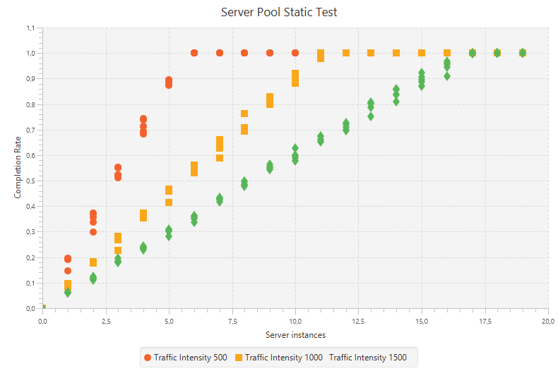
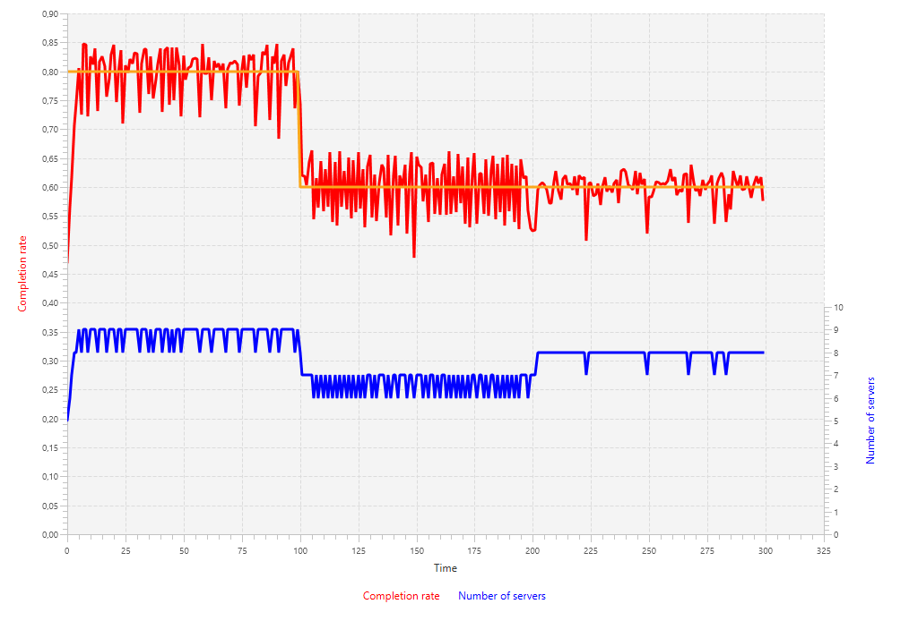
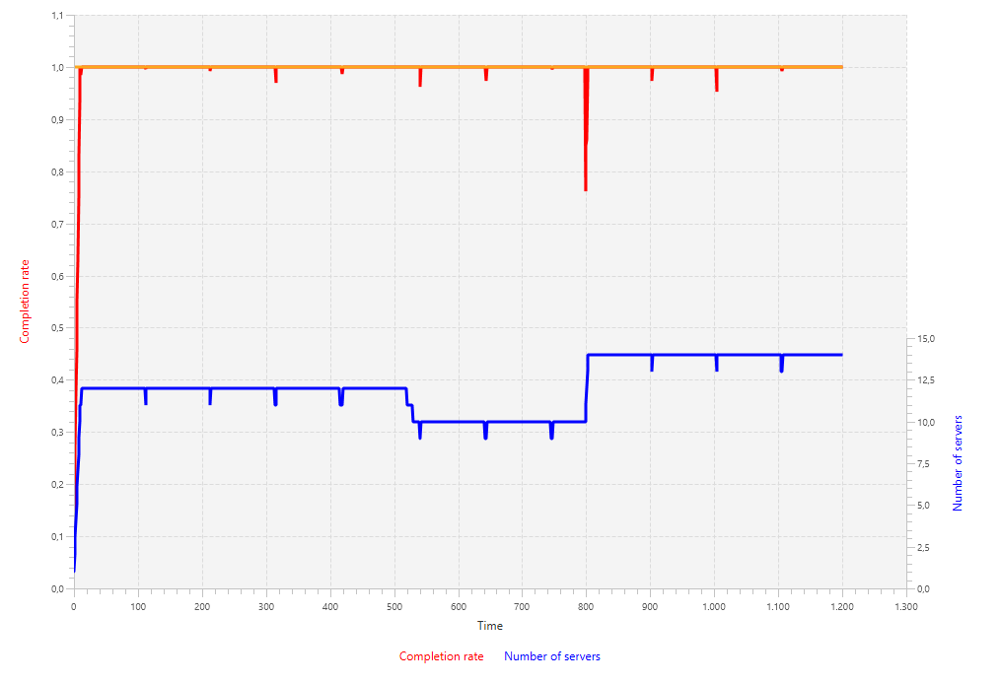
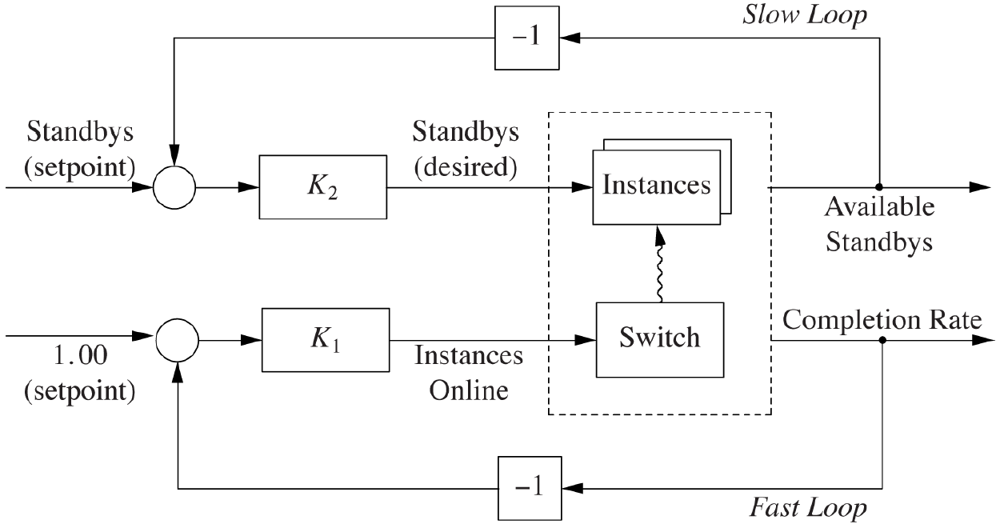

#Server Scaling
In cloud computing we often deal with a complex system that takes in jobs, distributes them over the system, where they are executed. For a simple cloud based system that is based on an *[Infrastructure as a Service](http://en.wikipedia.org/wiki/Cloud_computing#Infrastructure_as_a_service_.28IaaS.29)* architecture, the jobs are often taken in by a head node that distributes them over multiple worker nodes. These worker nodes are often leased from a cloud provider (Amazon EC2, Microsoft Azure, etc.), where you only pay for the time they are used. Once a job is finished, the result is send back to the head node, which returns it to the user.

While creating a cloud application you have a number of issues to deal with. Your system should run with *as less human intervention as possible*. This means that you have to implement some smart algorithms to get a good performance. Your customers will send you jobs to be executed and don't like to wait a long time for their results to come back. Therefore you need to *lease and release* virtual machines depending on how many job are in the system and what their loads are. In literature this is also referred to as *elasticity* or *auto-scaling*. Also jobs need to be scheduled or distributed over the available virtual machines evenly, such that every jobs can be completed as fast as possible.

A challenging question in this whole problem is when to lease an extra machine? After all, it takes a couple of minutes for a new machine to be up and running and after that time, the machine might not be needed or it turned out that only one new machine was not enough. And when to release a machine? In fact, you don't know whether or not you will urgently need the machine seconds after its release.

## A first approach
The underlying problem is typically a problem that can be solved using feedback control. Let us first consider a simplified version of this problem, where we will assume the following:

1. Control actions are applied periodically, with constant intervals in between.
2. In the intervals between in control actions, jobs come in at the head node and are handled by the worker nodes
3. If a job comes in and no worker nodes are available, then the job is send back as a failure. Jobs will not be queued, so there will be no accumulation of pending jobs.
4. We can obtain the number of incoming and handled jobs for each interval.
5. The number of jobs that arrive during each interval is a random quantity, as is the number of jobs that are handled by the worker nodes.
6. Leasing a worker does not take any time. They are immediately available and do not need any time to spin up!

This set of specifications will seem weird at first glance, but will later turn out to be a nice starting point for approaching the general problem of elasticity. From a control perspective, the absence of a queue is important: a queue is a form of memory, which leads to more complicated behavior and internal dynamics.

### System design
With this set of specifications in mind, we can now define the input and output variables for the controlled system. The number of active servers will be the control input variable. The output will be the success ratio, which is defined as the ratio of completed to incoming jobs. The goal is to maximize this ratio and get it as close to 100% as possible.

This design results in the following implementation for the `ServerPool` that we will use in our simulations. Here `server` is a function that indicates how many jobs are handled by the system and `load` is a function that determines how many jobs are submitted per interval. We will discuss implementations of these functions later. Finally, `n` is the number of workers that are available.

```scala
class ServerPool(n: Int, server: () => Double, load: () => Double, res: Double = 0.0) extends Component[Int, Double] {

	def update(u: Int): ServerPool = {
		val l = load()

		if (l == 0) {
			new ServerPool(n, server, load, 1)
		}
		else {
			val nNew = math.max(0, u)
			val completed = math.min((0 until nNew).map { _ => server() }.sum, l)
			new ServerPool(nNew, server, load, completed / l)
		}
	}

	def action: Double = res

	def monitor = Map("Completion rate" -> res, "Servers" -> n)
}
```

###Tuning the controller
Just as we did in the previous case study, we will now look at the static process characteristics, which determines what the size and direction of the ultimate change in the process output is when an input of a certain size is applied. Again we simulated multiple scenarios and came to the following figure:



This shows that the success rate is proportional to the number of worker nodes until there are enough workers to handle all submitted jobs. Also notice that the slope and saturation point are determined by the traffic intensity.

Performing a dynamic response test is not necessary, since we can already conclude that there are no partial responses. When `n` worker nodes are requested, we will get them all (possibly after some delay); not a portion at first and the rest later! Although this may seem good news at first, we have to realise the consequences of not having partial responses. After all, we need to find values for a controller to act in the control loop which only can be found by measuring a delay τ and a time constant T. However, in this case there is no delay, causing the tuning formulas end up in dividing by zero! Therefore we need to find another method to get to these controller values.

Luckily we can combine the three types of tuning formulas and come up with the following set of formulas:


Here *Δu* is the static change in the control input and *Δy* is the corresponding change in the control output. The values for *a*, *b* and *c* are typically chosen somewhat arbitrarily in the following ranges:


From the measurements taken in the static process characteristics we can see that *Δu* = 5 and *Δy* = 0.45 for the orange line. With that in mind we choose `kp = 1` and `ki = 5`.

We implement a first simulation that runs for 300 time units and has a setpoint of 0.8 until 100 time units and 0.6 afterwards. Notice that these are far from ideal, since we actually want a setpoint of 1.0. Since there are some issue with this value as a setpoint (as discussed later) we will stick to these lower values for now.

The `server` function is based on a beta variate distribution, since this makes sure that every worker in the model does some finite work. The `load` function is based on a normal distribution but changes over time, such that the simulated workload is not always the same.

```scala
val global_time = 0

def simulation(): Observable[Double] = {
	def time: Observable[Long] = (0L until 300L).toObservable observeOn ComputationScheduler()
	def setpoint(t: Long): Double = if (t < 100) 0.8 else 0.6
	
	def server() = 100 * Randomizers.betavariate(20, 2)
	def load() = {
		global_time += 1

		if (global_time < 200) Randomizers.gaussian(1000, 5)
		else Randomizers.gaussian(1200, 5)
	}
		
	val p = new ServerPool(8, server, load)
	val c = new PIDController(1, 5) map math.round map (_ toInt)

	Loops.closedLoop(time map setpoint, 0.0, c ++ p)
}
```

Running this simulation will result in the following chart:



These results show that in the first 100 time units the number of servers oscillates between 8 and 9. Clearly 8 workers is often not enough, whereas 9 is too much. We see the same thing happen between time units 100 until 200, where 6 workers is too few and 7 is too much.

Also the completion rate does not perform well. It oscillates with amplitudes of 5 to 10 percent. Notice that the diminishing of the oscillations in the last part of the simulation (time units 200 until 300) is not due to a mechanic in the system, but rather a change in the amount of traffic.

### Getting close to 100 percent
Of course having a completion rate of 60% or 80% is not exactly the behavior we would expect from a cloud based system. We want all jobs to be completed and none being rejected. Therefore we prefer to have the completion rate at 100%. Taking a closer look at the theory behind feedback control systems will however reveals an important thing we cannot forget: if our setpoint value is 100% (or 1.0), then the tracking error can never be negative and hence no workers can be released in this particular example!

A simple solution to this would be to choose a setpoint value sufficiently close to 1.0, for example 0.995. But choosing this will face us with an unusual asymmetry in the tracking error. Everything from 0 to 0.995 produces a positive error, whereas everything from 0.995 to 1.0 causes a negative error. In a PID controller this means that control action that tend to increase the number of workers will be 100 times stronger than those who will decrease the number of workers.

This is fixable by applying different weights to positive and negative control actions of a PID controller. In the following implementation of `AsymmetricPIDController` we apply a ratio of 1:20 for positive and negative control actions.

```scala
class AsymmetricPIDController(kp: Double, ki: Double, kd: Double = 0.0, integral: Double = 0, deriv: Double = 0, prev: Double = 0)(implicit DT: Double) extends Component[Double, Double] {

	def update(error: Double): AsymmetricPIDController = {
		val e = if (error > 0) error / 20.0 else error

		val i = integral + DT * e
		val d = (prev - e) / DT

		new AsymmetricPIDController(kp, ki, kd, i, d, e)
	}

	def action = prev * kp + integral * ki + deriv * kd

	def monitor = Map("Asymmetric controller" -> action)
}
```

This results in a simulation that is improved a bit with respect to the first simulation, but still gives large oscillations in the number of servers and has completion rates that differ up to 10% of the actual setpoint.


### A better approach
At this point we need to take a step back and look at what we are really facing. First of all, it should be clear by now that the control input must be a positive integer. We can only have a whole number of workers; not halves or thirds are allowed. Secondly, until now we have looked at the *magnitude* of the error, rather than the *sign*.

With these two things in mind, lets create a control strategy that is way simpler than the PID controller's strategy:

1. Let the setpoint be 1.0; causing the tracking error to never be negative.
2. If the tracking error is positive, add an extra worker to the worker pool.
3. If the tracking error is zero, do nothing.
4. Periodically decrease the number of workers by 1 and see whether a smaller number is sufficient.

Step 4 is crucial in order to allow for workers to be released. This can be improved even further by scheduling trial steps more frequently after releasing a worker than after leasing a worker. Implementing this in the simulation framework results in the following `SpecialController`:

```scala
class SpecialController(period1: Int, period2: Int, time: Int = 0, res: Int = 0) extends Component[Double, Double] {

	def update(error: Double): SpecialController = {
		if (error > 0)
			new SpecialController(period1, period2, period1, 1)
		// at this point we know that the error must be 0
		else if (time == 1)
			new SpecialController(period1, period2, period2, -1)
		else
			new SpecialController(period1, period2, time - 1, 0)
	}

	def action = res

	def monitor = Map("Special controller" -> action)
}
```

Notice that this is an incremental controller: it does not keep track of the number of leased workers but rather gives instructions on leasing or releasing any machines. Therefore we need to include an `Integrator` between the controller and the plant.


A simulation using this approach is very effective, as shown in the following chart. The number of servers stays constant and periodically checks whether a worker could be released. Between time units 500 and 600 we can nicely see the effect of scheduling more frequent test steps after a successful release. Three times in short period of time the controller tries to lower the number of workers. The first and second time, this is successful, the third time it turns out that this worker is really needed.



## Spinning up the server
Until now we have made the assumption that newly requested servers are available instantaneously. In practice however, it often takes about a minute or 2 until a requested server is available. Given that the control actions take place on the order of seconds, this is simply too big of a delay to be ignored.

A rule of thumb in designing feedback loops is to "*redesign the system to avoid delay*". Although this might seem strange at first, it is worth taking seriously, since alternative like the [Smith predictor](http://en.wikipedia.org/wiki/Smith_predictor) are even more complicated!

In our case, we can have a set of "*warm standbys*" that are controlled by a separate feedback loop. Instead of requesting new servers and waiting a couple of minutes for them to be active, we can just get extra instances from the second feedback loop. The latter controls the number of standby instances and is supposed to act in a time scale that is equal to the time it takes to spin up a new instance. With this last choice, we allow the new instances to be again available immediately from the perspective of the second loop.



## Summary
In cloud computing we often deal with a (complex) system that receives jobs from its users and distributes those over several workers. These workers are leased by cloud providers and are only payed for the time they are used. One of the challenges while implementing such a system is to come up with a good policy for auto-scaling. When to lease or release a machine?

A simplified version of the problem assumes that jobs will never be queued and instead be rejected if immediate processing is not possible. Besides that we assume that newly requested servers are directly available; no spin up time is required. We found that a PID controller is not appropriate to use in this setup, especially as the setpoint requests a completion rate close to 100%. Instead we used a simpler control strategy that performs great with the goal of 100% completion rate.