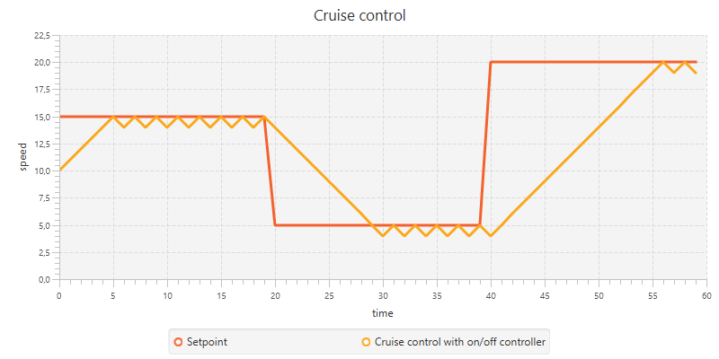
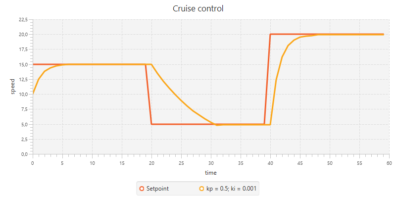
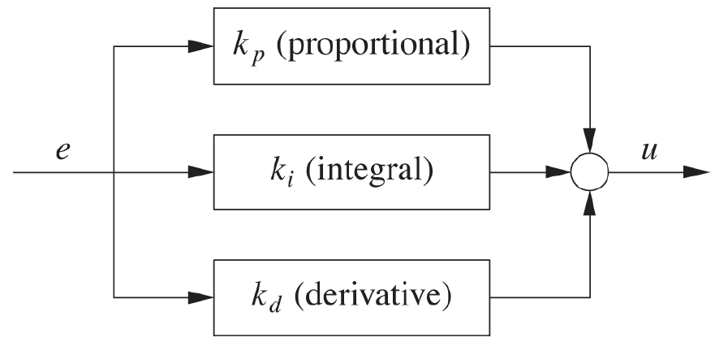

#Controllers
Previously we have seen how a feedback system (see the image below) is constructed by looping the controlled system's output `y` back into a comparison with a reference value `r`, and providing the resulting error `e` to a controller `K`, which generates the next input `u` for the controlled system `H`. In this section we will discuss the role of the controller in a feedback system. Its most obvious role is to do the 'smart' numerical work, but we also need to consider the different types of controllers, which may improve the stability, performance and accuracy of the system as a whole.


When designing a feedback system for controlling the size of a cache we need to consider what the input and output of the cache itself are within the feedback loop. Our reference value is a desired hit rate, which is depicted as a value between 0 and 1, as is the cache's output, to which it is compared. From this comparison, we send the error (`desired value - output`) to the controller, which is a value in the range -1 to 1. The controller then needs to calculate a new size for the cache and therefore needs to convert a ratio into a size.

The same holds for designing a feedback system for the example of a pipe feeding into a water tank. Here the water tank's output might be a ratio (to what percentage it is filled) or a volume (how many cubic meters of water are in), which the controller needs to convert into an action on the water supply. This action depends on the type of water supply: can it be only *opened* and *closed* or are there more states in between?

##Controller types
In general we can thus say that the controller serves the purpose of translating the controlled system's output signal into its next input signal. But as we just saw, the controller might be different, depending on the situation.

###On/Off control
The simplest controller is the on/off switch. Whenever the error is positive, the controlled system is turned on and visa versa. This is a very simple approach, but in practice not very effective since the system will not settle to a steady state. It will rather oscillate rapidly between its two states.

To show this behavior, let's implement a cruise control feedback system that uses an on/off controller. To keep the behavior of the cruise control simple, we expect any changes to be applied immediately, without any form of lag or delay. We define a class `SpeedSystem` which has a function `interact(setting: Boolean): Int` which respectively increases and decreases the `speed` variable depending on the `setting: Boolean` being `true` or `false`. We also define speed limits that vary over time in the `setPoint` function.

```scala
class SpeedSystem(var speed: Int = 10) {
	def interact(setting: Boolean) = {
		speed += (if (setting) 1 else -1)
		speed
	}
}
```

```scala
def simulation(): Observable[Int] = {
	def setPoint(time: Int): Int = if (time < 10) 15 else if (time < 20) 10 else 20
	val ss = new SpeedSystem

	Observable(subscriber => {
		val speed = BehaviorSubject(ss.speed)
		speed.subscribe(subscriber)
		
		Observable.from(0 until 40)
			.map(setPoint)
			.zipWith(speed)(_ - _)
			.map { x => if (x > 0) true else false }
			.map(ss.interact)
			.subscribe(speed)
	})
}
```

This results in the diagram below. Here we can clearly see the oscillating behavior of the system, rather than stabilizing it on the desired value.



###Proportional control
To improve the control we have over the system, we need to come up with something better than an on/off controller. An obvious step is to take the magnitude of the error into account when deciding on the magnitude of the corrective action. This implies that a small error leads to a small correction, whereas a large error leads to a greater corrective action. To achieve this, we let the control action be proportional to the tracking error:


Here  is the controller gain, which is a positive constant.

Although this controller might be very useful in some cases, it shows one of its weaknesses when applied to the cruise control example. To do so, we first need to redefine the `SpeedSystem` class, since we now provide a `power: Double` rather than a `setting: Boolean`. If the `power` is zero or lower, the speed drops by 10%; else we increase the speed by the given power.

```scala
class SpeedSystem(var speed: Double = 10) {
	def interact(power: Double) = {
		if (power <= 0) {
			speed = (0.90 * speed) roundAt 1
		}
		else {
			speed = (speed + power) roundAt 1
		}
		speed
	}
}
```

Now we can use the standard pattern for the simulation:

```scala
def simulation(): Observable[Double] = {
	def setPoint(time: Int): Int = if (time < 20) 15 else if (time < 40) 5 else 20
	val ss = new SpeedSystem
	
	Observable(subscriber => {
		val speed = BehaviorSubject(ss.speed)
		speed.subscribe(subscriber)
		
		Observable.from(0 until 60)
			.map(setPoint)
			.zipWith(speed)(_ - _)
			.map { k * _ }
			.map(ss.interact)
			.subscribe(speed)
	})
}
```

In the diagram below we see the results with two values for . These simulations show the typical behavior of a proportional controller. The simulation with `k = 0.2` simply never reaches the setpoint but rather stabilizes on a different value. In this case the actual stabilization value is just a little bit off, but a similar case was already shown in the [non-cumulative cache example](Feedback-Systems.md#experiment-2---noncumulative-controller).

The other simulation (`k = 0.5`) does reach the actual setpoint, from which it follows that the next tracking error will be zero. This causes the controller to output zero, which is supplied to the `SpeedSystem`. As discussed before, this causes the speed to drop with 10%, from which the system can start rising the speed again.


What happens here in general is that the proportional controller can only produce a nonzero output if it gets a nonzero input. This directly follows from the equation above. As the tracking error diminishes, the controller output will become smaller and eventually will be zero. However, some systems (like the cruise control system or a heated pot on a stove) need a nonzero input in the steady state. If we use a proportional controller in such systems, the consequence will be that some residual error will persist; in other words the system output `y` will always be less than the desired setpoint `r`. This phenomenon is known as *proportional droop*.

###Integral Control
To solve problems caused by proportional droop, we introduce a new type of controller. This controller does not look at the *current* tracking error, but uses the *sum of all previous tracking errors* to produce its newest control action. As we know from mathematics, in a continuous stream a sum becomes an integral (hence its name), resulting in the following equation.


In our examples this controller is implemented as a `scan` operation, followed by a `map` and can be found in previous experiments like the [cumulative cache experiment](Feedback-Systems.md#experiment-1---cumulative-controller):

```scala
trackingError.scan((sum: Double, e: Double) => sum + e).map { k * _ }
```

Most often, this controller is used in combination with the proportional controller in order to fix the earlier discovered problems with the nonzero input in the steady state phase. The integral term in this so called *PI controller* takes care of this by providing a constant offset. When the proportional term is zero (due to the tracking error being zero), the integral term will not turn zero, since it takes the historical errors into account as well.

We can show the effect of combining the proportional  and integral controllers by modifying the cruise control simulation. We add a class that holds the proportional and integral terms and replace `.map { k * _ }` from the previous implementation with `.scan(new PI)(_ work _).drop(1).map(_.controlAction)`. Notice that we here drop the first emitted item: this is the initial item `new PI` which we do not want in the control loop but rather be there as a seed for what comes in the first control iteration.

```scala
class PI(val prop: Double = 0, val integral: Double = 0) {
	def work(error: Double): PI = {
		new PI(error, integral + error)
	}

	def controlAction(kp: Double, ki: Double) = {
		prop * kp + integral * ki
	}
}
```

```scala
def simulation(): Observable[Double] = {
	def setPoint(time: Int): Int = if (time < 20) 15 else if (time < 40) 5 else 20
	val ss = new SpeedSystem
	
	Observable(subscriber => {
		val speed = BehaviorSubject(ss.speed)
		speed.subscribe(subscriber)
		
		Observable.from(0 until 60)
			.map(setPoint)
			.zipWith(speed)(_ - _)
			.scan(new PI)(_ work _)
			.drop(1)
			.map(_.controlAction(kp, ki))
			.map(ss.interact)
			.subscribe(speed)
	})
}
```

By using this code sample we find a correct implementation for the cruise control system. Notice that we still use `kp = 0.5` and that we only need a very slight integral correction with `ki = 0.001` to achieve this.



### Derivative control
Besides the proportional controller and integral controller, which respectively control based on the present and the past, we can also try to control a feedback system based on a prediction of the future. This is done by the derivative controller. From mathematics we know that the derivative is the rate of change of some quantity. Therefore we can conclude that if the derivative of the tracking error is positive, the tracking error is currently growing (and vice versa). From this conclusion we can then take action and react to changes as fast as possible (before the tracking error has a chance to become large).

Mathematically we can express the derivative controller by the following equation:


Even though '*anticipating the future*' sounds promising, there are a number of problems with the derivative controller. First of all a sudden setpoint change will lead to a large momentary spike, which will be the input of the controlled system. This effect is known as *derivative kick*.  
Besides that the input signal of the controller can have a high-frequency noise. Taking the derivative of such a signal only makes things worse by enhancing the effect of the noise.

### PID control
The most common use of the derivative controller is in combination with the proportional and integral controllers, forming a three-term *PID controller*. Here we use all three controllers and sum the outcomes.



We implement this in the same way as we did for the PI controller:

```scala
class PID(val prop: Double = 0, val integral: Double = 0, val deriv: Double = 0, prevErr: Double = 0) {
	def work(error: Double, DT: Double = 1): PID = {
		new PID(error, integral + error, (error - prevErr) / DT, error)
	}

	def controlAction(kp: Double, ki: Double, kd: Double) = {
		prop * kp + integral * ki + deriv * kd
	}
}
```

Notice that the function `work` takes a parameter `DT` with default value `DT = 1`. This value is used in calculating the derivative to account for multiple iterations within one time unit. If time is measured in seconds and there are 100 control actions, then `DT = 0.01`. Since our simulations currently do not depend on the time unit, we can assume that we do 1 control action per time unit, from which it follows that `DT = 1`.

Also notice that with introducing this controller, the PI controller is needed anymore, since it is equivalent to a PID controller with `kd = 0.0`.

## Summary
In this section a number of controllers have been discussed. The most primitive one is the **on/off controller**. This can only signal the controlled system to turn on or off. Its results are quite poor and often cause oscillating behavior.

An improvement is introduced in the **proportional controller**, which takes the tracking error and multiplies it with some constant . This controller performs well as long as the tracking error is not close to zero. Some types of controlled systems still need a nonzero input when the tracking error gets zero. This is what a proportional controller cannot offer.

To solve this issue, an **integral controller** can be added. This keeps track of the sum of all previous tracking errors and multiplies that with its constant . Together with the proportional controller, this controller makes up the **PI controller**, which combines the power of both.

Besides reacting to the present tracking error and taking the past into account, we can also try to predict the future. We do this with the **derivative controller**, which takes the change of the tracking error and multiplies that with the constant . Together with the PI controller, the **PID controller** is formed.
