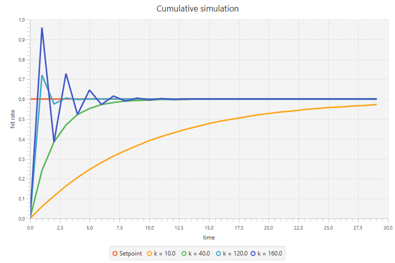
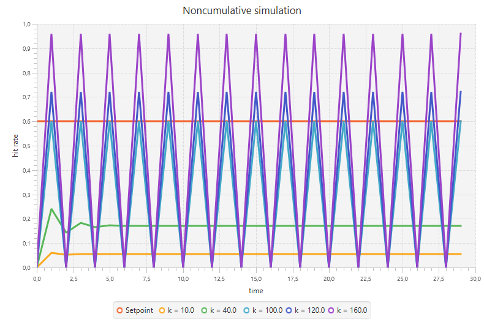
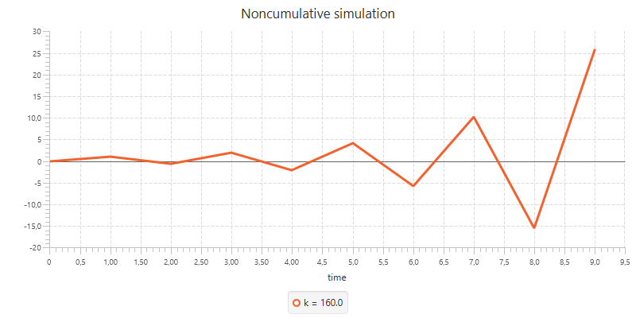

#Feedback systems
Feedback control is based on the *feedback principle*:
> Continuously compare the actual output to its desired reference value; then apply a change to the system inputs that counteracts any deviation of the actual output from the reference.

To put this in other words, when the output is higher the reference value, a correction to the next input is applied, which will lead to a reduction in the output. Also, if the output is too low, the input value will be raised, such that the next output will be closer to the reference value. Schematically this **closed-loop system** is shown below, where the output is looped back and used in the calculation for what the next input will be.


Compare this with a **open-loop system**, where the output is not taken into account.


## The components of a closed-loop system
A basic closed-loop system consists of a number of components that are shown in the first image. When an output in the system is produced, it is compared with the reference value (usually known as the **setpoint**). This comparison produces a *tracking error*, which is the deviation of the output from the setpoint:
> tracking error = setpoint - previous output

The tracking error is used in the **controller** to determine the system's next input. Usually when the tracking error is positive (the previous output was too low) the controller has to produce a new control input that will raise the output of the process. The reverse holds for the case where the tracking error is negative.

Notice that the controller does not need any knowledge about the system's internal behavior but instead only needs to know the **directionality** of the process: does the input need to be raised or lowered in order to raise the output value? In practice both situations will occur: increasing the power of a heating element will lead to an increase in temperature, whereas an increase of the power of a cooler will lead to a decrease.

Besides the directionality, the controller also needs to know the **magnitude** of the correction. After all, the controller could overcompensate a positive tracking error, resulting in a negative tracking error. This often results in a **control oscillation**, which is rarely desirable.

However, it can be worse: if the controller overcompensates a positive tracking error in such a way that the resulting negative tracking error needs an even bigger compensating action, then the amplitude of the oscillations will grow over time. In that case the system will become unstable and will blow up soon. It needs no explanation that this unstable behavior needs to be avoided.

Besides overcompensating, a controller can also show timid or slow behavior: the corrective actions are too small. This causes tracking errors to persist for a long time and makes the system responding slow to disturbances. Although this is less dangerous than instability, this slow behavior is unsatisfactory as well.

In conclusion we can say that we want the magnitude of the controller's correction as large as possible such that it does not make the system unstable.

## Iterative schemes
It will be clear by now that a closed-loop system uses an iterative scheme, where each control action is supposed to take the system closer to the desired value. Repeating the process of comparing the previous output with the desired value and using that to calculate the next iteration's input will reduce the error. As with each iterative scheme, we are presented with three fundamental questions:

1. Does the iteration converge?
2. How quickly does it converge?
3. To what value does it converge?

The answer to the first question lies in the settings of the system's controller. If the controller does not overcompensate too much (if the amplitude of the oscillations will never build up), the iteration will converge.

The same holds for the second question: if the controller is set to react slow, it will take longer for it to converge. To make the iteration converge quickly, the controller has to be set such that it will produce the largest correction without causing oscillations.

Although the third question may seem obvious (the iteration will converge to the setpoint), sometimes the settings of the controller will result in converging to an incorrect value, which might be higher or lower than the setpoint.

It turns out that the three goals that are related to these questions (stability, performance and accuracy) can not be achieved simultaneously. The design of feedback systems will always involve trade-offs between stability and performance, since a system that responds quickly will tend to oscillate. It depends on the situation which aspect will be emphasized.

## Example: cache simulation
To illustrate the aspects of a feedback system that are discussed in on this page, we will simulate behavior of a system that controls the size of a cache. In this example we will not implement a cache but rather simulate its hit rate by the following function:

```scala
def cache(size: Double): Double = math.max(0, math.min(1, size / 100))
```

### Experiment 1 - Cumulative controller
In our first simulation we will have a constant setpoint (or hit rate for cache requests) of 60%.

```scala
def simulation(): Observable[Double] = {
	def setPoint(time: Int): Double = 0.6
	def cache(size: Double): Double = math.max(0, math.min(1, size / 100))

	Observable((subscriber: Subscriber[Double]) => {
		val hitrate = PublishSubject[Double]

		Observable.from(0 until 30)
			.map(setPoint)
			.zipWith(hitrate)(_ - _)					// calculate hitrate
			.scan((sum: Double, e: Double) => sum + e)	// calculate cumulative hitrate
			.map { k * _ }								// calculate next input
			.map(cache)									// calculate newest output
			.subscribe(hitrate)

		hitrate.subscribe(subscriber)
		hitrate.onNext(0.0)
	})
}
```

Running this simulation with different values of `k` will yield the following:



For `k = 10` we see that it takes more than 30 iterations to get only close to the hit rate. Also `k = 40` turns out to be a bit slow (but faster than the previous), for which it takes 27 iterations to get to the desired value (although the output is already at 59.3% after 9 iterations). With either one of these settings the controller would be effective in the long run, but will take to much time to react to changes.

On the other hand, if we look at the case of `k = 160`, we see a clear overshooting in the first iteration to a value of 96%, from which it overshoots again to 38.4% and so on. Just as the case of `k = 40` it will get to the desired hit rate after 27 iterations, although it already is really close after 9 iterations.

The same (but less drastic) holds for `k = 120`: it overshoots the first time to 72%, but already converges to 60% after 8 iterations.

Searching for the most optimal value for `k` is obvious in this case and already becomes clear in the code: `k = 100`. With this configuration the controller is already at the desired value after 1 iteration. Although it is easy to find in this example, in practice it often turns out to be much more difficult to find the most optimal value for `k`.

It should be noticed in the code that we use a feature of the controller that is not yet discussed so far: calculating the cumulative error and using this value for producing the next input rather than using the tracking error itself. We will get to this technique later. We can however already show the difference between using and not using this cumulative error.

### Experiment 2 - Noncumulative controller
We get to a noncumulative version of the simulation by removing the following single line from the previous listing: `.scan((cum: Double, e: Double) => cum + e)`. Running the simulation with the same values for `k` will yield the following chart:



These results look far from right. The smaller values for `k` will converge, although not to desired value. The larger values however will not converge but will rather oscillate between 0 and `setpoint * k / 100`. Looking closely to what happens, reveals that this is due to the way the `cache` function is implemented (it maps negative values to 0). If we would change this function to `def cache(size: Double): Double = size / 100` (notice that this would not make sense in the context of a cache), we see an overshooting that will explode in the long run. Extrapolating will yield that after 30 iterations we get an output of over 300000!



### Experiment 3 - Changing setpoint
Now let's see what happens if we change the setpoint during the experiment. In order to do so we change the definition of the `setpoint` function to:

```scala
def setPoint(time: Long): Double = if (time < 30) 0.6 else if (time < 60) 0.8 else if (time < 90) 0.1 else 0.9
```

For this experiment we use the cumulative implementation again, since this gives us the desired outputs.


As expected, the simulations follow the setpoint values with their own characteristics. `k = 100` again is the most optimal here and reaches the desired value immediately after it is changed. The case of `k = 160` again overshoots the setpoint and reaches the desired value in that way, whereas `k = 40` slowly converges by taking smaller steps.

## Summary
We have seen the basic components that together make up a feedback system. First we compare the system's previous output with the reference value (or **setpoint**) and feed the resulting **tracking error** into the **controller**. Based on this, the controller calculates the system's next **input**. The system's **output** is then compared again with the setpoint.

The controller only needs to know about the **directionality** of the process and the **magnitude** correction. It does not need any understanding of the internal workings of the controlled system. The magnitude of the correction determines whether the controller will overcompensate or react too slow. Overcompensating may lead to heavy oscillations which can cause the system to get out of control.
