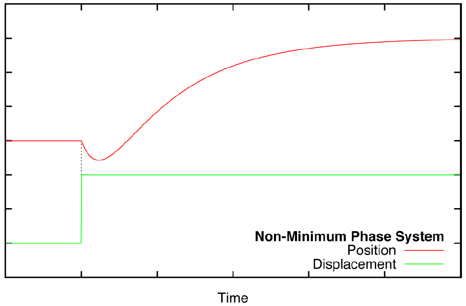
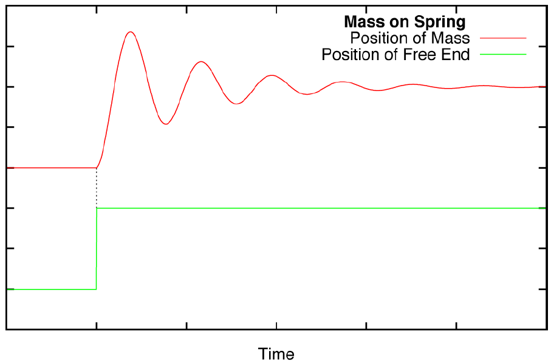
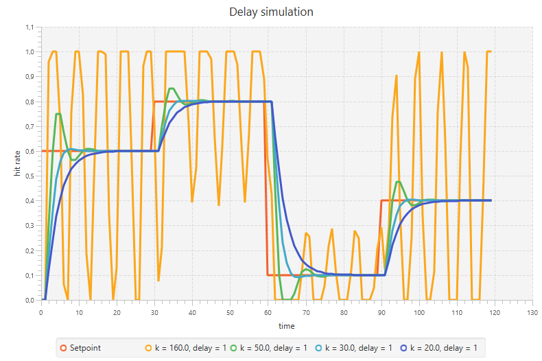

#System dynamics
In the previous [cache example](https://github.com/rvanheest/Literature-Study-Feedback-Control/wiki/Feedback-Systems#example-cache-simulation) we made the assumption that the cache responds immediately to a change. Although this may seem an obvious choice (after all, we are manipulating the state of a computer program, which can be changed in an instant), there are cases where we have to be more careful. While working with cloud computing, requesting 20 more instances from the cloud data center will take a couple of minutes before they 'arrive'. In the meantime these instances are not available for any requests, but when they are online, they are immediately fully operational. Handling this with a feedback system is a harder task, since there is a certain time between the control action and the response.

Although in the virtual world these delays only occur in certain systems, they always occur in the physical world. Besides delays, we also have to deal with lags and inverse responses if we are designing a feedback system that involves physical world objects. This is due to the fact that this world is continuous, where objects cannot move from a certain position A to another position B in an instant. In fact they are bounded to a certain non-infinite velocity, which may require large amounts of force, energy and power, which may not be available or even impossible to supply. This makes designing feedback systems very hard and often results in error prone outputs.

##Lag, delay and inverse response
For a good understanding, we need to take a closer look to lags, delays and inverse responses first and give some examples.  
A system has **lag** when it slowly responds to a control input. It will respond immediately, but it will take while before it reaches the desired value. This is also called an **immediate partial response**. An example of this is applying heat to a pot on the stove. As soon as the heat is applied, the temperature in the vessel gradually starts to rise. When the heat is turned of, the temperature will gradually drop back to the environment's temperature.


As discussed before, **delay** manifests itself by not responding immediately to the control input. In the cloud computing example we saw that when the control input asks for 20 more instances, it takes a while before these are available.  
In practice we see that delay and lag can be combined. As an example we set up a feedback system for the water level in a tank, where the water input comes from a long pipe feeding into the tank. When we fire the control input, the water starts to flow from the valve at the beginning of the pipe to the tank. However, it will take some time before the water level starts to rise, since the water needs to travel a certain distance (this is the delay). The water that comes in tank will however not cause the tank to be at the desired water level immediately but rather fill up slowly (this is the lag). This process is depicted in the image down below.


Besides lag or delay, a system can also give an **inverse response**, also referred to as a **non-minimum phase system**. When a control action is applied in a certain direction, the system responds by first going into the other direction, before going along with the control action. This causes a behavior as depicted in the image down below. An example of this is a flexible fishing rod: when it is yanks *back*, its tip will first move *forward*.



##Response components
In general we can divide the system's responses to a control action into two categories: forced and free response. The **forced response** is caused by the external disturbance due to the control action, whereas the **free response** is cause by the system's internal structure. For the heated vessel the forced response is the temperature going up because of the heat supply. However, as soon as the heat supply is turned off, the temperature drops down again, which is due to its free response of matching the temperature with its environment. On the other hand, the water tank does not have any free response: the water level stays the same if no water flows from the pipe into the tank.

From another perspective we can divide the system's response into **transient components**, which decay over time and **steady-state components**. We can view the latter as the component which realizes the goal of a control action, whereas the transient component is some form of an unwanted side-effect, which decays over time. The time it takes for all the transient components of a control action to disappear makes a good metric for the performance of the feedback system.

As an example, let's look at a [mass on a spring](http://en.wikipedia.org/wiki/Simple_harmonic_motion#Mass_on_a_spring). When we give the other end of the spring a sudden jerk, the mass will begin to oscillate, which will eventually die away (depending on the spring constant), after which we are left with an overall displacement of the mass. Here the final displacement is the goal of our feedback system and thus the steady-state component of the response. The oscillation is a transient component which fades away after a while.



##Example: Cache with delay
To illustrate what a delay will do to a feedback system in practice, we will extend the [cache example](https://github.com/rvanheest/Literature-Study-Feedback-Control/wiki/Feedback-Systems#experiment-3---changing-setpoint) by adding a delay to the system. In order to do so, we need to change the output stream (`val hitrate`) from being a [`PublishSubject`](https://github.com/ReactiveX/RxJava/wiki/Subject#publishsubject) into a [`BehaviorSubject`](https://github.com/ReactiveX/RxJava/wiki/Subject#behaviorsubject) and develop an [extension method](https://coderwall.com/p/4clu3a/extension-methods-in-scala) that will cause the delay.

```scala
def simulation(): Observable[Double] = {
	def setPoint(time: Int): Double = if (time < 30) 0.6 else if (time < 60) 0.8 else if (time < 90) 0.1 else 0.4
	def cache(size: Double): Double = math.max(0, math.min(1, size / 100))

	Observable((subscriber: Subscriber[Double]) => {
		val hitrate = BehaviorSubject[Double]

		Observable.from(0 until 120)
			.map(setPoint)
			.zipWith(hitrate)(_ - _)
			.scan((sum: Double, e: Double) => sum + e)
			.map { k * _ }
			.map(cache)
			.delay(delay, 0.0)
			.subscribe(hitrate)

		hitrate.subscribe(subscriber)
	})
}
```

As discussed before, delay manifests itself by not responding immediately to the control input. Thus, during the delay, the output lags behind a number of iterations. Reasoning back to the start of this feedback system, it follows that there was a certain initial output value to the system before it responded to the first control actions. From this, the implementation of the extension method `delay(steps: Int, initVal: T)` is as follows:

```scala
object DelayExtension {
	class DelayObservable[T](obs: Observable[T]) {
		def delay(steps: Int, initVal: T) = (Observable.from(List.fill(steps)(initVal)) ++ obs).slidingBuffer(steps, 1).map(_.head)
	}
	
	implicit def delayObservable[T](obs: Observable[T]) = new DelayObservable(obs)
}
```

In this implementation we start off with a number of constant initial values, followed by the original stream of values. On this we use a sliding buffer of side `steps` (the number of iteration of the delay), which causes the stream to buffer and wait for the right amount of values.

With only 1 step of delay and using the control gain `k = 160` (which used to work fine without delay) we already get very bad behavior. The cache's hit rate continuously oscillates between 0% and 100% and causes unstable behavior.

A better control gain is `k = 50`, which still overshoots a little, but stabilizes soon on the requested hit rate. This overshooting is almost gone at `k = 30` and not even there at `k = 20`. We see here that the latter even is maybe a bit to careful and takes too small steps.



When we use a delay of 2 iterations, we find that the range of suitable values for the control gain shrinks quite a bit: `k = 50` is not suitable anymore to stabilize the hit rate within 30 iterations. `k = 30` only barely makes it to stabilize and `k = 20` also overshoots a bit, but stabilizes right after that. We also see `k = 10`, which is not sufficient enough to stabilize within 30 iterations.


A longer delay makes it even worse! When set to 5 iterations, we cannot find a suitable value that stabilizes within 30 iterations. `k = 30` and `k = 20` totally overshoot the hit rate, whereas `k = 15` and `k = 10` make good attempts in overshooting a bit, but are too slow to catch up.


It is clear that the longer a delay is, the worse gets on finding a suitable value for the control gain that stabilizes to the setpoint within a reasonable amount of iterations. If possible, a delay should be avoided in the phase of designing a feedback control system.

## Summary
The controlled systems often exhibit some **internal behavior** that we need to take into account while designing a feedback system. It might be that the system exhibits **lag**, which causes it to only respond partially to the input. Another type of internal behavior is **delay**, where it takes a certain amount of time to respond to the control input. Also, the system might have a **non-minimum phase**, causing it to first go the opposite way before going along the control input values.

The response of the control system consists of two components: **steady-state**, which realizes the goal of the control action, and **transient**, which is some form of unwanted side-effect that decays over time. The time it takes to decay is a good metric for the quality of the feedback system.